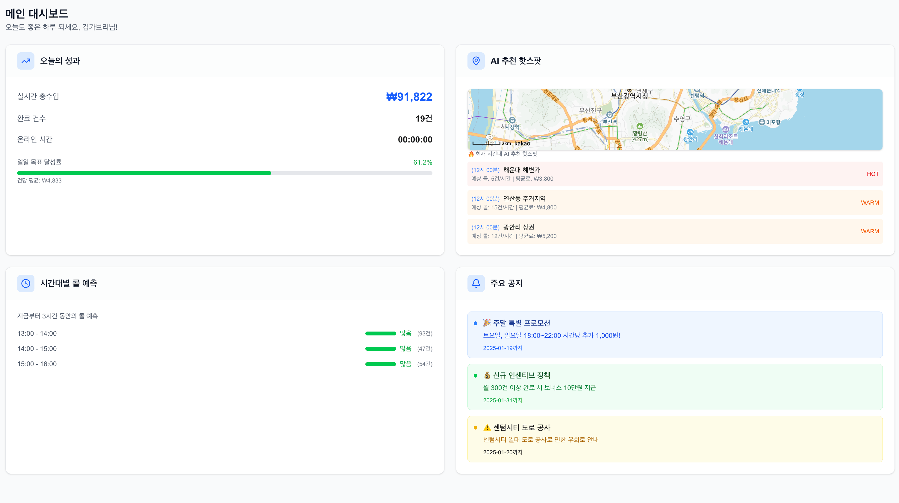
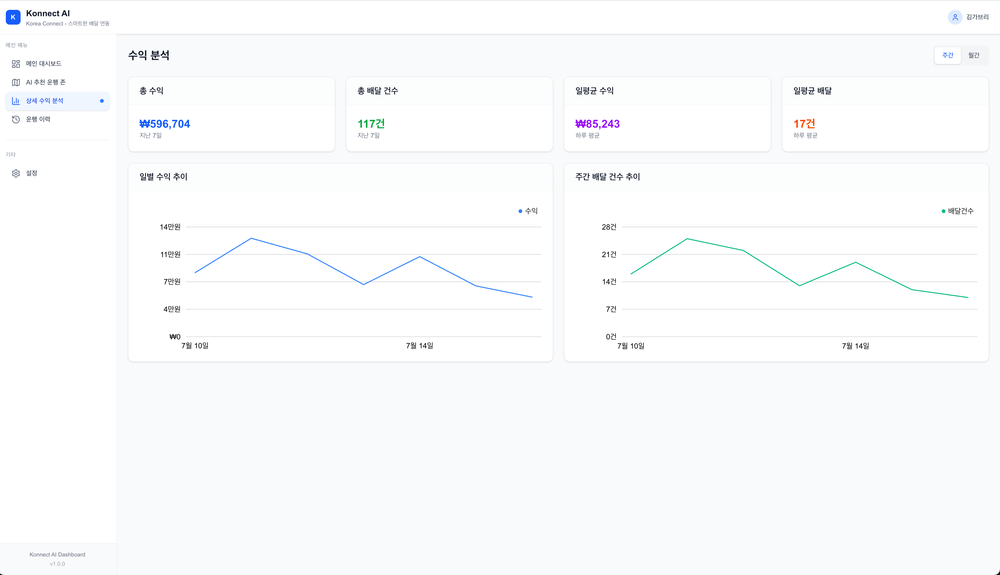

# 🛵 Konnect AI: 데이터 기반 배달 라이더 대시보드

**"감에 의존하는 배달은 이제 그만! 데이터를 통해 스마트하게 일하고 더 많이 버세요."**

Konnect AI는 배달 라이더를 위한 AI 기반 데이터 분석 및 운행 추천 플랫폼입니다. 실시간 수익 현황, AI가 예측하는 주문 밀집 지역(핫스팟), 상세한 수입 분석 데이터 등을 제공하여 라이더가 '데이터'에 기반한 최적의 의사결정을 내릴 수 있도록 돕습니다.

<br/>

## ✨ 주요 기능 (Features)

### 1. 한눈에 보는 메인 대시보드

오늘의 성과(수입, 건수, 운행 시간)와 목표 달성률을 실시간으로 확인하고, AI가 추천하는 핫스팟과 시간대별 콜 예측 정보를 통해 다음 동선을 효율적으로 계획할 수 있습니다.



### 2. AI 추천 운행 존

AI가 분석한 데이터를 바탕으로 가장 수익성이 높은 운행 지역을 추천합니다.

- **실시간 히트맵**: 현재 주문이 몰리는 지역을 히트맵으로 한눈에 파악합니다.
- **AI 예측 폴리곤**: 과거 데이터와 실시간 정보를 분석하여, 미래에 주문이 많을 것으로 예상되는 'AI 추천 존'을 지도 위에 폴리곤으로 표시합니다. 시간대별 예측 필터로 특정 시간에 가장 확률이 높은 지역을 확인할 수 있습니다.
- **상세 추천 정보**: 각 추천 존을 클릭하면 예상 콜 수, 평균 배달비, 신뢰도 등 상세 정보를 제공하여 데이터 기반의 의사결정을 돕습니다.


### 3. 상세 수익 및 운행 이력 분석

일별/주별/월별 수익 트렌드, 수익 구성(기본료, 프로모션, 팁) 등 다각적인 데이터 분석을 통해 자신의 수입 패턴을 정확히 파악하고 개선점을 찾을 수 있습니다. 모든 운행 내역은 상세 테이블로 제공됩니다.

 

### 4. 사용자 친화적인 인증 및 상세 설정

안전한 이메일/비밀번호 기반의 회원가입 및 로그인 기능을 제공하며, NextAuth.js를 통해 소셜 로그인 확장도 용이합니다. 또한, 사용자 경험을 위한 상세한 맞춤 설정 기능을 제공합니다.

- **운행 맞춤 설정**: 일일/월간 목표 수익, 선호 운행 시간, 최소 주문 금액, 최대 배달 거리, 자동 주문 수락 등 라이더의 운행 스타일을 완벽하게 지원합니다.
- **앱 환경 설정**: 라이트/다크 모드 테마, 언어(한국어/영어), 지도 초기 화면 등 앱의 사용 환경을 취향에 맞게 변경할 수 있습니다.
- **알림 설정**: 신규 주문, 목표 달성, 프로모션 등 중요한 정보를 푸시 또는 이메일로 받아볼 수 있도록 선택적으로 제어할 수 있습니다.


## 🛠️ 기술 스택 (Tech Stack)

| 구분                 | 기술                                                 |
| -------------------- | ---------------------------------------------------- |
| **Frontend**         | Next.js (v15), React (v19), TypeScript, Tailwind CSS |
| **State Management** | React Query (v5), Zustand                            |
| **UI & Charting**    | Tremor, Lucide Icons, tailwind-variants              |
| **Form**             | React Hook Form, Zod                                 |
| **Map**              | Kakao Maps API (`react-kakao-maps-sdk`)              |
| **Backend**          | Next.js (App Router API Routes)                      |
| **Database**         | PostgreSQL (Supabase)                                |
| **ORM**              | Prisma                                               |
| **Authentication**   | NextAuth.js (v5)                                     |
| **Deployment**       | Vercel                                               |

## 🏗️ 시스템 아키텍처


## 📀 데이터베이스 스키마 (Prisma)

프로젝트의 핵심 데이터 모델 구조입니다. `User`를 중심으로 `RiderProfile`, `Delivery` 등이 관계를 맺고 있으며, AI 추천 데이터를 위한 `AIZone`, `HeatmapPoint` 등의 모델을 설계했습니다.

<details>
<summary><strong>Core Models (클릭하여 확인)</strong></summary>

```prisma
// /prisma/schema.prisma

// --- User & Authentication ---
model User {
  id           String        @id @default(cuid())
  email        String        @unique
  name         String
  password     String?
  riderProfile RiderProfile?
  accounts     Account[] // For NextAuth social login
  sessions     Session[]
  // ...
}

// --- Rider Information ---
model RiderProfile {
  id           String        @id @default(cuid())
  user         User          @relation(fields: [userId], references: [id])
  userId       String        @unique
  dailyGoal    Int           // 일일 목표 수익
  monthlyGoal  Int           // 월간 목표 수익
  vehicleType  VehicleType
  deliveries   Delivery[]
  userSettings UserSettings?
  // ...
}

model UserSettings {
  id             String       @id @default(cuid())
  riderProfile   RiderProfile @relation(fields: [riderProfileId], references: [id])
  riderProfileId String       @unique
  theme          Theme        // LIGHT | DARK | SYSTEM
  language       Language     // KOREAN | ENGLISH
  mapDefaultZoom Int
  // ...
}

// --- Delivery Data ---
model Delivery {
  id            String       @id @default(cuid())
  riderProfile  RiderProfile @relation(fields: [riderId], references: [id])
  completedAt   DateTime
  pickupAddress String
  totalEarnings Int
  rating        Float
  // ...
}

// --- AI & Analytics ---
model AIZone {
  id              String             @id @default(cuid())
  name            String
  coordinates     Json // Polygon coordinates for the zone
  expectedCalls   Int
  avgFee          Int
  predictions     AIZonePrediction[]
  recommendations AIRecommendation[]
  // ...
}

model AIRecommendation {
  id          String             @id @default(cuid())
  zone        AIZone             @relation(fields: [zoneId], references: [id])
  type        RecommendationType // e.g., HISTORICAL_DATA, EVENT
  title       String
  description String
  // ...
}

model HeatmapPoint {
  id        String   @id @default(cuid())
  lat       Float
  lng       Float
  weight    Float    // Represents order density
  timestamp DateTime
  // ...
}
```
